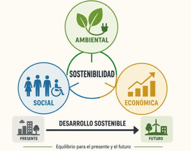

La sostenibilidad busca mantener un equilibrio entre las necesidades humanas, la actividad económica y la conservación del entorno. Una decisión sostenible no se limita a resolver un problema inmediato, sino que también considera sus consecuencias futuras sobre las personas y el planeta.

## 3.1.  Concepto

La sostenibilidad es la capacidad de satisfacer las necesidades actuales utilizando los recursos de forma responsable, sin impedir que las generaciones futuras puedan satisfacer las suyas. Esto implica analizar las consecuencias de nuestras decisiones a largo plazo. Por ejemplo, sustituir constantemente los equipos informáticos puede mejorar temporalmente el rendimiento de una empresa, pero también incrementa el consumo de materias primas y la generación de residuos electrónicos.

Una actividad será más sostenible cuanto mejor consiga:

- Utilizar eficientemente la energía y los materiales.
- Reducir la generación de residuos
- Proteger el entorno natural
- Respetar los derechos y el bienestar de las personas.
- Mantener su viabilidad económica a largo plazo.

## 3.2. Desarrollo sostenible

El desarrollo sostenible es el modelo de progreso que permite mejorar la calidad de vida y desarrollar la actividad económica sin agotar los recursos naturales ni provocar daños sociales o ambientales irreversibles. Aunque ambos conceptos están relacionados, no significan lo mismo:

- **Sostenibilidad:** Es el objetivo. Alcanzar un equilibrio duradero entre economía, sociedad y medioambiente.

- **Desarrollo sostenible:** Es el proceso y el conjunto de decisiones que permiten alcanzar ese equilibrio.

Por tanto, el desarrollo sostenible no pretende detener el progreso, sino modificar la forma en que se produce. Una empresa puede seguir innovando y creciendo, pero debe hacerlo utilizando los recursos de manera eficiente y considerando las consecuencias de sus decisiones.

## 3.3. Dimensiones de la sostenibilidad

La sostenibilidad se apoya en tres dimensiones interrelacionadas:

| Dimensión { .table-main-column .table-cl-secundario .table-bg-principal } | Finalidad { .table-cl-secundario .table-bg-principal .table-full-container }| Ejemplo {.table-cl-secundario .table-bg-principal } |
|---|---|---|
| Ambiental {.table-cl-secundario .table-bg-principal .table-text-bold } | Proteger los recursos naturales reduciendo el impacto sobre el planeta. | Reducir el consumo energético de servidores y aplicaciones. |
| Social {.table-cl-secundario .table-bg-principal .table-text-bold } | Favorecer el bienestar, la igualdad y los derechos de las personas. | Crear aplicaciones accesibles y evitar la brecha digital. |
| Económica {.table-cl-secundario .table-bg-principal .table-text-bold } | Garantizar que la actividad pueda mantenerse de forma viable a largo plazo. | Diseñar servicios digitales eficientes y sostenibles económicamente. |

{ .imagen-contenido }

*Figura 1. Dimensiones de la sostenibilidad.*

Una decisión no puede considerarse plenamente sostenible si solo atiende a una de estas dimensiones. Por ejemplo, una aplicación con un consumo energético muy bajo no sería completamente sostenible si vulnera la privacidad de sus usuarios o genera condiciones laborales injustas.

## 3.4. Sostenibilidad empresarial

La sostenibilidad empresarial consiste en integrar estas tres dimensiones en las decisiones y actividades de una organización. La empresa debe buscar rentabilidad, pero también identificar y gestionar los efectos que produce sobre el entorno y las personas.

En una empresa de desarrollo web, decisiones relacionadas con la sostenibilidad serían:

- Elegir proveedores de alojamiento eficientes.
- Optimizar las aplicaciones para reducir el procesamiento y la transferencia de datos.
- Alargar la vida útil de los equipos informáticos.
- Garantizar la accesibilidad de los servicios digitales.
- Proteger los datos y la privacidad de los usuarios.

La sostenibilidad deja así de ser una acción aislada – como reciclar papel o apagar las luces – para convertirse en un criterio que debe estar presente en toda la estrategia de la organización